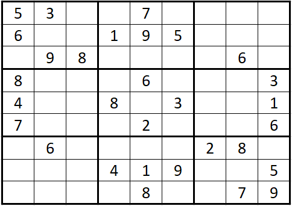

# Valid Parentheses

## Instructions
  
- Create new file in the folder *challenges\ValidSudoku\Submissions*. Name it using the format of the following example:
> Andres_Abundis_ValidSudoku.c

- Copy the function header in file *challenges\ValidSudoku\FunctionHeader.c*.
- Paste it in the file you just created and develop your solution there.
- Please do not copy the solution/ideas of the other members of the community.
- Working in the solution by yourself is the best way to develop your skills!

## Deadline

The solution must be submitted to the folder *challenges/ValidSudoku/Submissions* before **Sunday the 1st of December at 11:59pm**.

## Evaluation

The Co-Leads of the community will evaluate the solutions
- We will evaluate time and memory complexity.
- We will measure the time it takes your program to execute a specific input.
- We will evualuate the originality of your solution.

## Problem Description

Determine if a 9 x 9 Sudoku board is valid. Only the filled cells need to be validated according to the following rules:

- Each row must contain the digits 1-9 without repetition.
- Each column must contain the digits 1-9 without repetition.
- Each of the nine 3 x 3 sub-boxes of the grid must contain the digits 1-9 without repetition.

Note:

- A Sudoku board (partially filled) could be valid but is not necessarily solvable.
- Only the filled cells need to be validated according to the mentioned rules.

## Examples

1. Example:\

Input:\
board =\
[["5","3",".",".","7",".",".",".","."],\
["6",".",".","1","9","5",".",".","."],\
[".","9","8",".",".",".",".","6","."],\
["8",".",".",".","6",".",".",".","3"],\
["4",".",".","8",".","3",".",".","1"],\
["7",".",".",".","2",".",".",".","6"],\
[".","6",".",".",".",".","2","8","."],\
[".",".",".","4","1","9",".",".","5"],\
[".",".",".",".","8",".",".","7","9"]]\

Output: true

2. Example:
Input:\
board =/
[["8","3",".",".","7",".",".",".","."],\
["6",".",".","1","9","5",".",".","."],\
[".","9","8",".",".",".",".","6","."],\
["8",".",".",".","6",".",".",".","3"],\
["4",".",".","8",".","3",".",".","1"],\
["7",".",".",".","2",".",".",".","6"],\
[".","6",".",".",".",".","2","8","."],\
[".",".",".","4","1","9",".",".","5"],\
[".",".",".",".","8",".",".","7","9"]]

Output: false

## Compiler online
"One compiler"
https://onecompiler.com/c/3yqyb97r9
